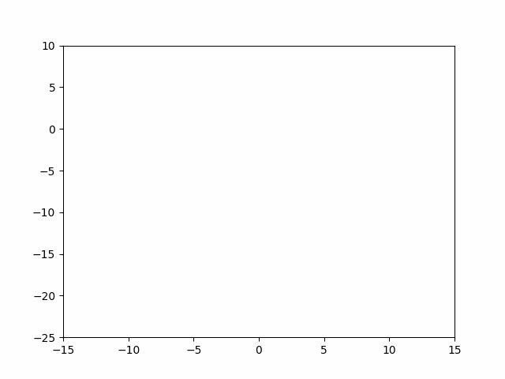
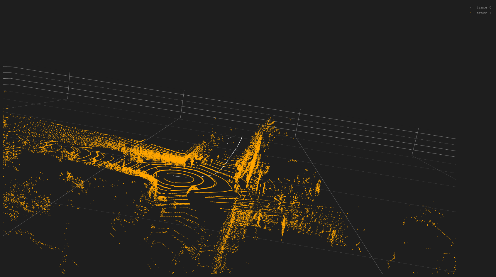

# iSAM based Pose Graph Optimization

  

This project focuses on SLAM using the GTSAM library. Specifically we do a simple Incremental Smoothing and Mapping that update the Bayes tree incrementally as new information becomes available.

## Algorithm
The algorithm is particularly simple (gtsam takes the difficult part). 
- Perform ICP on 2 consecutive point clouds to obtain Lie Algebra. 
- Add this as an odometry factor to the Non Linear Factor Graph
- Perform iSAM update. 

That's it :D

## Results
This is simple iSAM that was done on the G2O file of SE3 Poses. You can see some loop closure in action. 

  

The same idea of iSAM was extended to the ICP SLAM. Odometry results are as below

  

## Credits
Learning from this project comes from 

- roboticsbook.org
