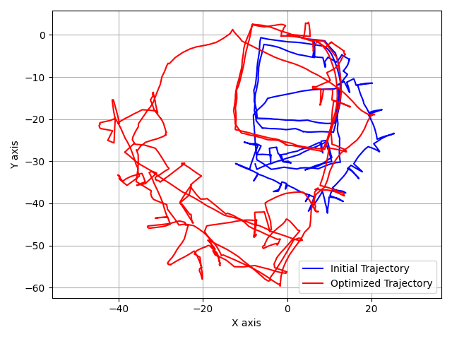
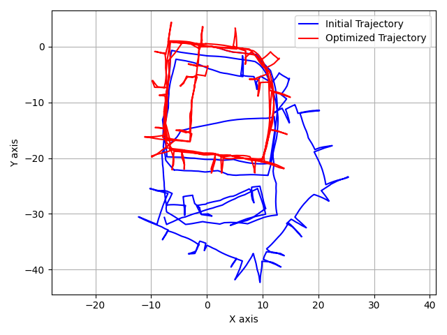
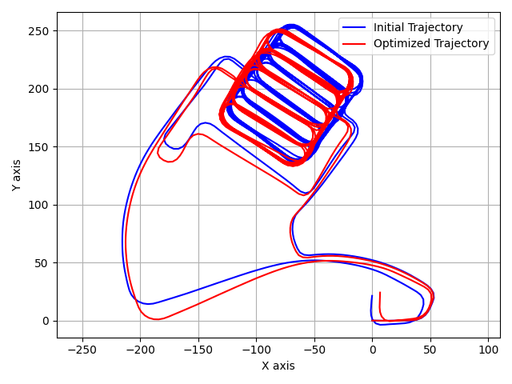

# SLAM Optimization with GTSAM
This project focuses on Simultaneous Localization and Mapping (SLAM) using the GTSAM library. 

## Project Structure
The project consists of Python scripts utilizing GTSAM for optimizing pose graphs in both 2D and 3D spaces. The key files include:

utils.py: Contains utility functions for reading and plotting g2o files, as well as handling information matrices.

isam.py: Defines functions for iSAM2d and iSAM3d optimization. These functions use incremental optimization to refine pose estimates based on a given pose graph.

batch.py: Implements batch optimization for 2D and 3D pose graphs. This script uses Gauss-Newton optimization to optimize the entire graph at once.

## Mathematical Overview

Pose Representation
2D Pose Representation: The 2D poses are represented as gtsam.Pose2 objects, including translation in the x and y axes and rotation.

3D Pose Representation: The 3D poses are represented as gtsam.Pose3 objects, including translation in the x, y, and z axes and 3D rotation.

## Factor Graphs
Graph Structure: The pose graph is represented as a factor graph. Nodes correspond to robot poses, and edges represent constraints between poses.

Factors: Factors model the relationships between poses. They include prior factors (representing initial estimates), and between factors (representing relative constraints between poses).

## Optimization
- iSAM2d and iSAM3d: Incremental Smoothing and Mapping optimization methods are used for online optimization. They update the Bayes tree incrementally as new information becomes available.

- Batch Optimization: Gauss-Newton optimization is applied for batch optimization. It aims to minimize the error between predicted and observed measurements by adjusting pose estimates.

## Results

